# BookStoreApplication
A basic book store application, written in ADF, Java, PLSQL. BookStoreApplication implements fundamental scenarios of a book library.

### Login Page
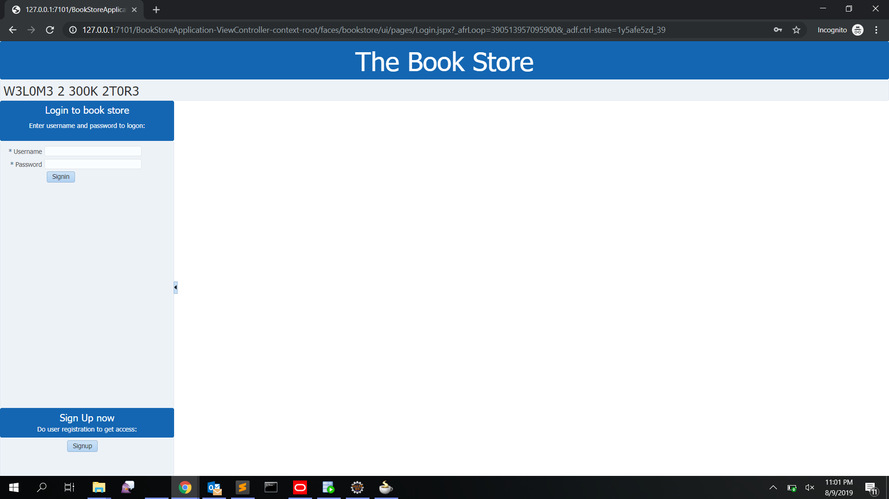
### Student Sign Up Page
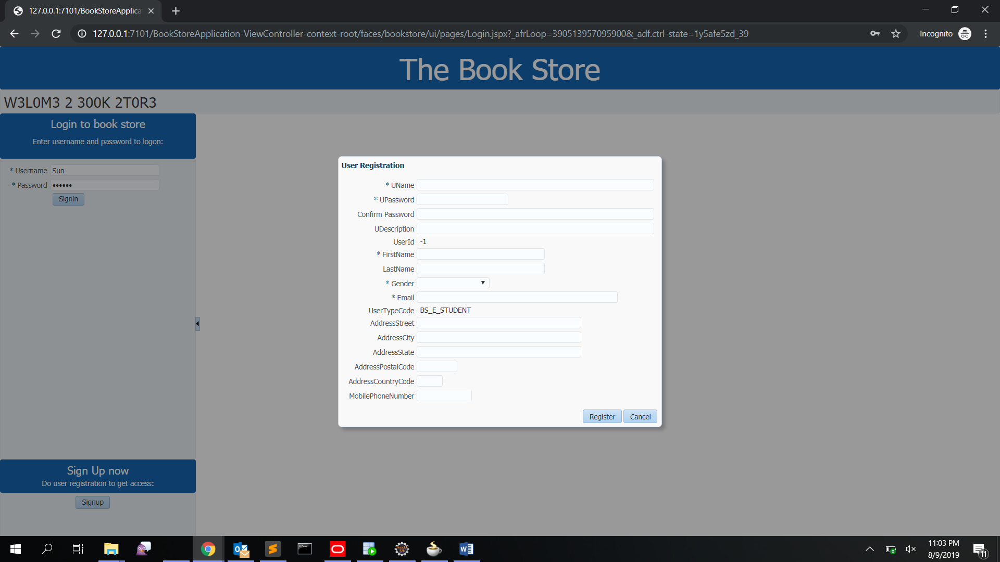
### Librarian Dashboard
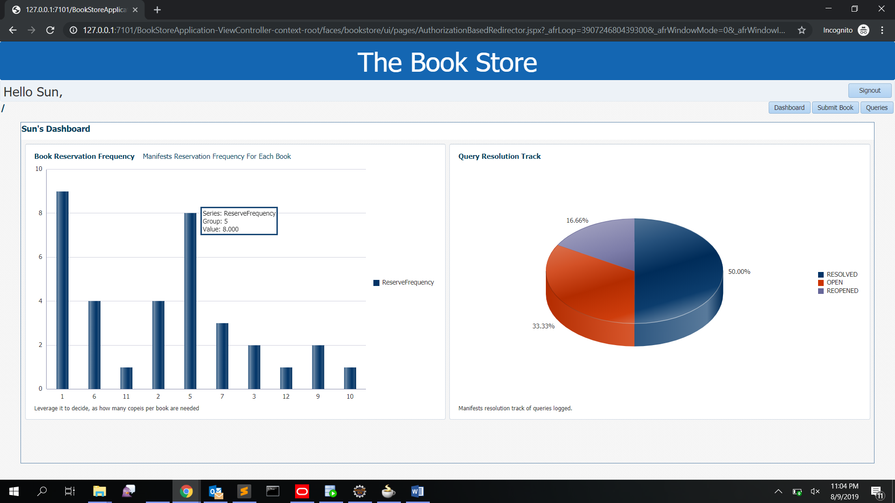 
### Librarian Query Panel [to address queries raised by students]
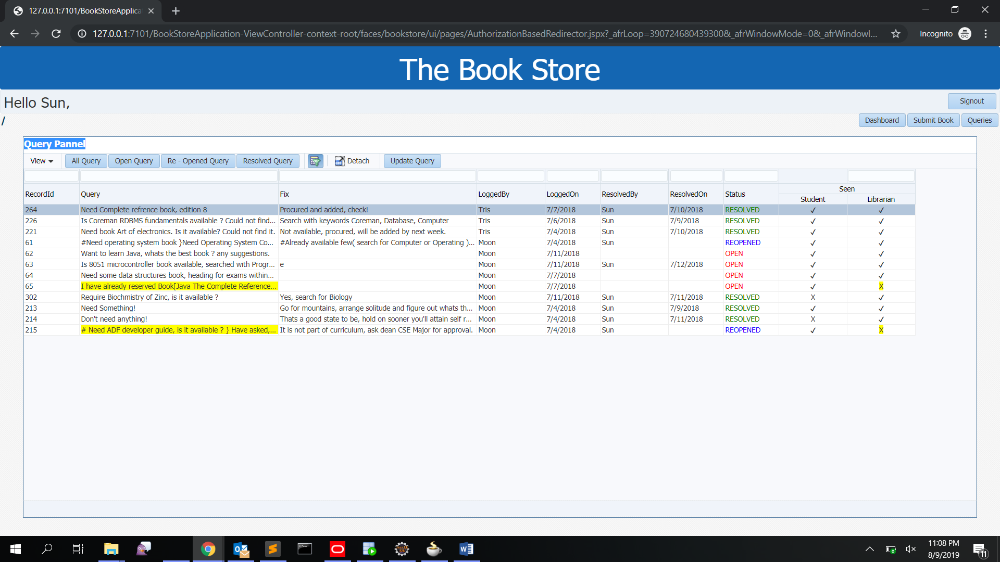
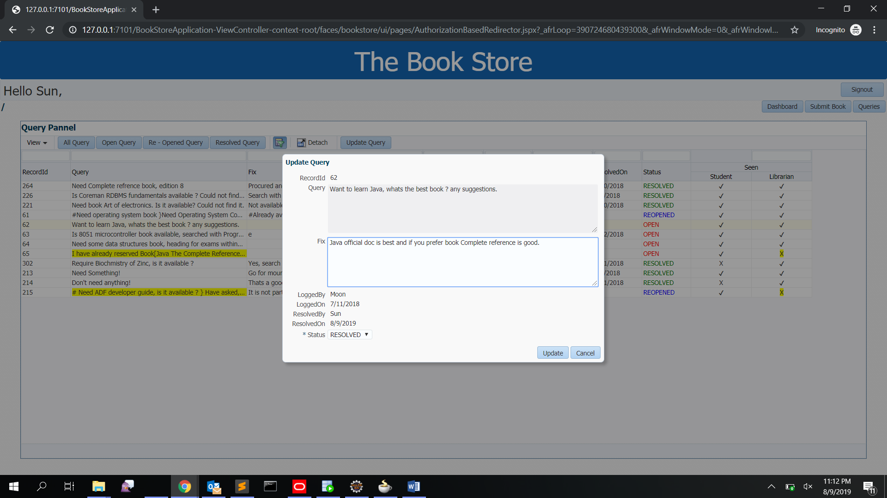
### Librarian Submit Book Panel [to submit book returned by student]
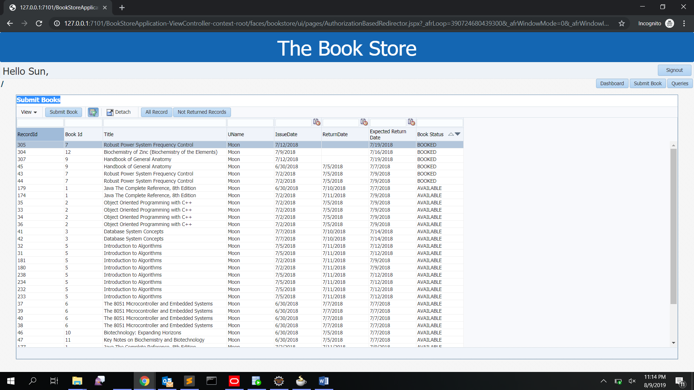
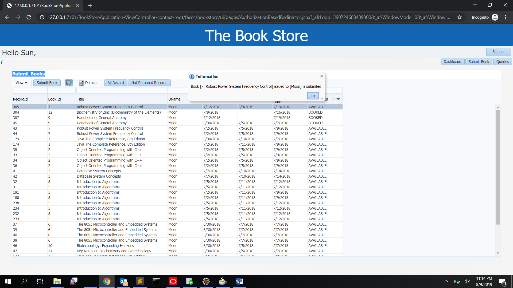
### Student Dashboard 
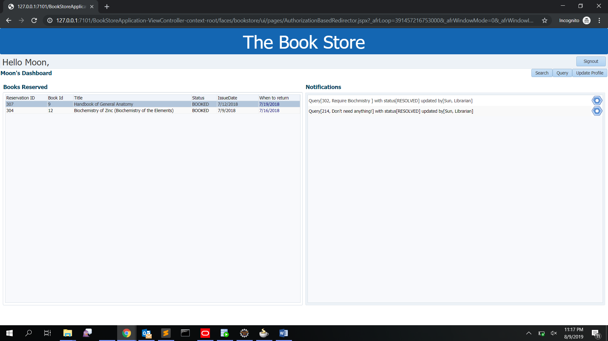
### Student Search/Issue Book Panel
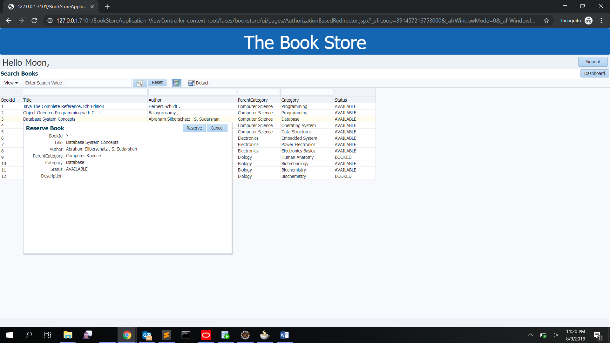
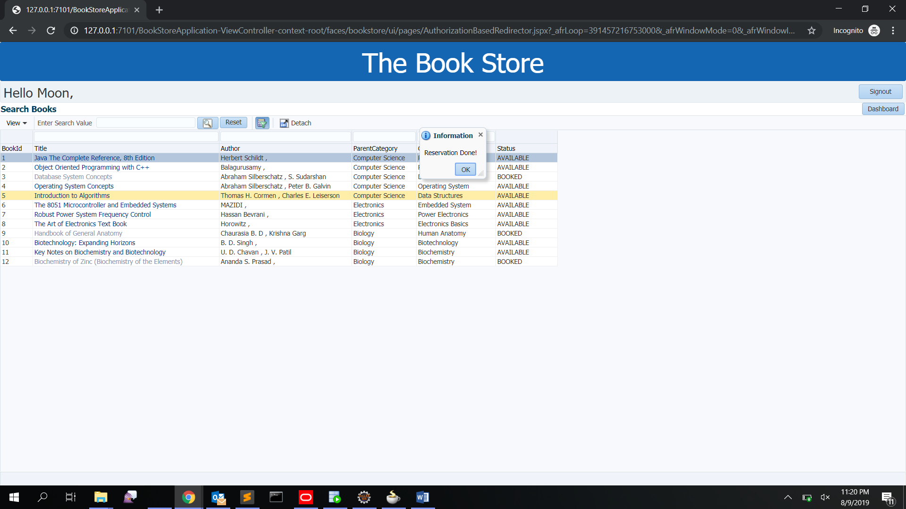
### Student Query Panel [to raise query and concerns to librarian]
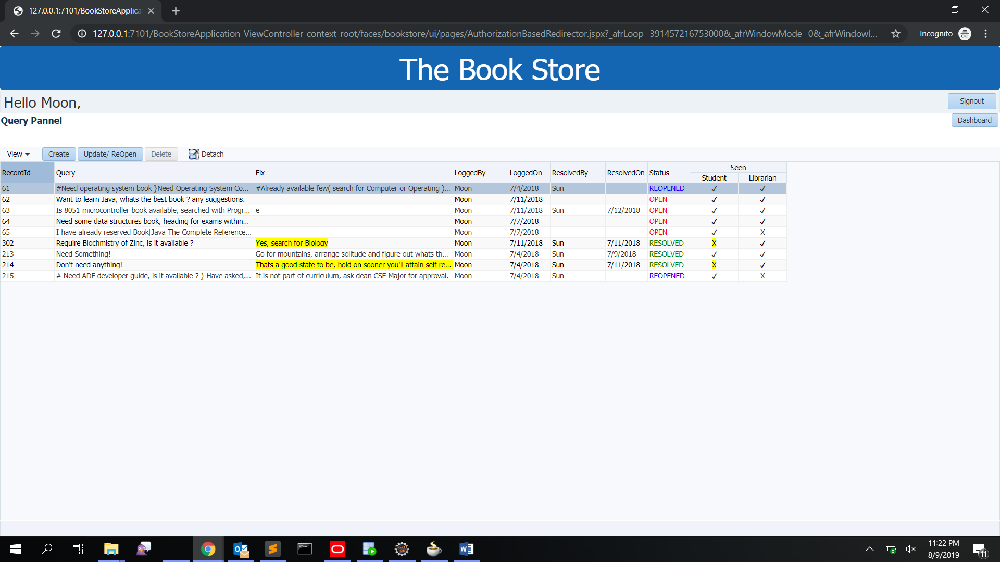
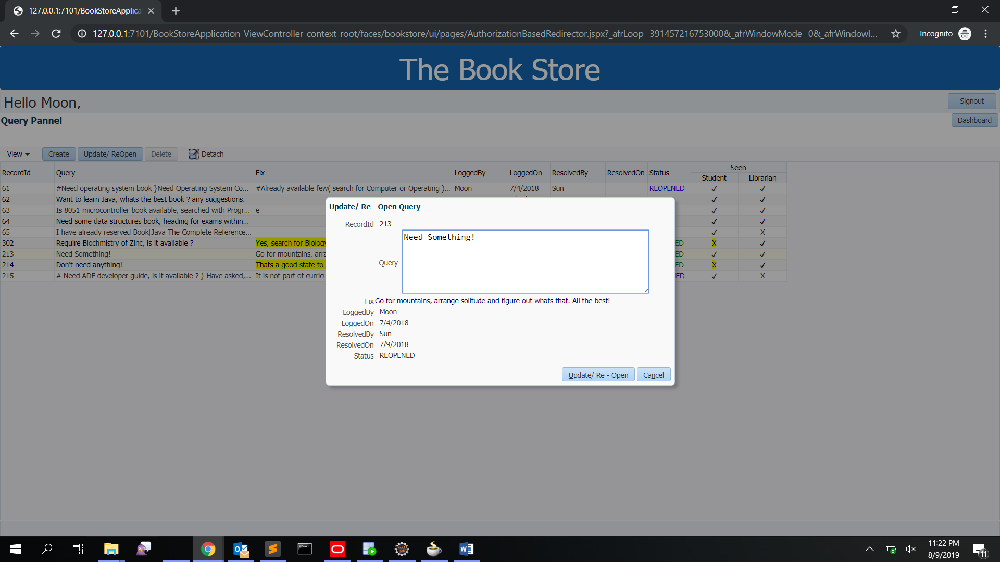